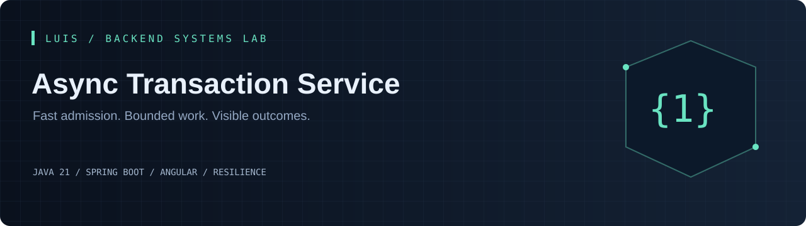
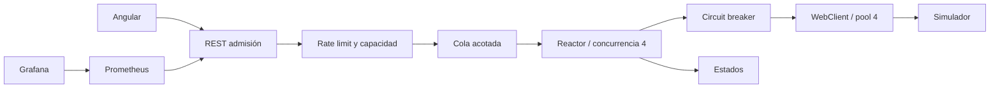

[](https://github.com/LuisDeveloper-Fer/async-transaction-service/actions/workflows/ci.yml)


[](LICENSE)

**Un proveedor lento puede agotar conexiones y bloquear una API. Este servicio desacopla la admisión de una transacción de su entrega HTTP, con límites explícitos de memoria, concurrencia y tiempo.**

Proyecto independiente del [Backend Systems Lab de Luis](https://github.com/LuisDeveloper-Fer). Código y datos de demostración, sin información propietaria ni dinero real.

## En 60 segundos

- REST con 202, Location y estado consultable
- Reactor, cola acotada y concurrencia limitada
- WebClient: pool HTTP, connect/response/acquire timeout y deadline
- Rate limit, circuit breaker y errores clasificados
- Prometheus, Grafana, correlation ID y contexto W3C

**Experimento principal:** Envía SUCCESS, SLOW, ERROR, NEVER y RATE_LIMIT. Compara el 202 inicial con el estado final. Provoca varios fallos para abrir el circuito y observa su recuperación.

## Probar en Internet

[**Abrir demo interactiva**](https://luisdeveloper-fer.github.io/async-transaction-service/) · Simulación en navegador, sin backend Java. [Alcance](docs/PUBLIC-DEMO.md).

## Vista previa


Interfaz con formularios de operación, estado consultable y detalle técnico desplegable. La imagen muestra la portada; para ejecutar el flujo completo sigue las instrucciones de abajo.

## Ejecutar

Requisitos: **JDK 21**, Maven 3.9+, Node 22.12+ para Angular y Docker Compose para el stack completo. [Compatibilidad de Spring Boot](https://docs.spring.io/spring-boot/system-requirements.html) · [Compatibilidad de Angular](https://angular.dev/reference/versions).

```bash
git clone https://github.com/LuisDeveloper-Fer/async-transaction-service.git
cd async-transaction-service
mvn clean package
docker compose up --build
```

| Componente | Dirección |
| --- | --- |
| Angular | http://localhost:4200 |
| API | http://localhost:8080 |
| Prometheus | http://localhost:9090 |
| Grafana | http://localhost:3000 · admin / local-demo-only |

Puertos publicados solo en loopback. Ejecuta un laboratorio a la vez o cambia API_PORT/UI_PORT/PROMETHEUS_PORT/GRAFANA_PORT en el entorno.

### Desarrollo local

```bash
node simulator/server.mjs # en otra terminal
mvn spring-boot:run
# otra terminal:
cd frontend
npm ci
npm start
```


## Arquitectura



La suscripción pertenece al worker, no al controlador. La admisión ocupa un permiso hasta terminar la entrega. Un timeout deja el resultado remoto desconocido: no reintentamos operaciones financieras sin un contrato de idempotencia. La cola volátil mantiene pequeño el laboratorio y hace explícito el costo de no usar una outbox.

[Decisión técnica](docs/adr/001-design.md) · [Contrato de API](docs/api.md) · [Guion de entrevista](docs/interview.md)

## Primer request

```bash
curl -i -X POST http://localhost:8080/api/transactions \
  -H 'Content-Type: application/json' \
  -H 'X-Correlation-ID: interview-01' \
  --data '{"amount":125.5,"currency":"PEN","scenario":"SUCCESS"}'
```

Ejemplo de respuesta, campos relevantes:

```json
{
  "id": "c6057e62-2782-456d-9157-b33440238078",
  "status": "QUEUED",
  "correlationId": "interview-01",
  "error": null
}
```

IDs y fechas cambian en cada ejecución. [Colección curl](examples/requests.sh) · [Payload JSON](examples/request.json).

## Endpoints

| Método | Ruta | Resultado |
| --- | --- | --- |
| POST | `/api/transactions` | 202; 400 inválido; 429 rate limit; 503 capacidad |
| GET | `/api/transactions/{id}` | Estado; 404 inexistente o expirado |
| GET | `/api/transactions` | Últimos 50 registros |
| GET | `/api/system` | Cola, capacidad y circuito |
| GET | `/actuator/prometheus` | Métricas |

## Pruebas

```bash
mvn clean package
cd frontend && npm ci && npm run build
```

Validación, clasificación de errores, admisión y capacidad; HTTP real para success, 429, slow, never, circuito abierto/recuperación, IDs y métricas. Las pruebas no necesitan Docker. CI compila Java y Angular. [Evidencia y límites de validación](docs/VALIDATION.md).

## Estructura

```text
src/main/java/dev/portfolio/
  api/              Contratos HTTP y validación
  application/      Casos de uso
  domain/           Estado y reglas
  infrastructure/   Clientes o repositorios
src/test/           Pruebas
frontend/           Angular standalone
ops/                Entorno de ejecución
docs/               Decisiones y guía técnica
examples/           Requests reproducibles
```

## Alcance honesto

Cola y registros en memoria; reiniciar pierde trabajo. Limpieza de terminales de más de 15 minutos al admitir nuevas operaciones; máximo 1000 registros, expulsando el terminal más antiguo al llenar el almacén. No hay entrega durable. Se propaga traceparent W3C, pero no se exportan spans. Límites y timeouts configurables mediante dispatch.*.

API de laboratorio sin autenticación, enlazada localmente. [secure-api-demo](https://github.com/LuisDeveloper-Fer/secure-api-demo) aborda seguridad por separado.

## Para una entrevista

1. Reproduce el experimento principal y explica el resultado.
2. Identifica dónde termina cada transacción y qué garantiza.
3. Explica qué ocurre ante un reinicio o una solicitud duplicada.
4. Justifica qué cambiarías para operar varias instancias.

---

**LuisDeveloper-Fer** · Java Backend Developer · [Los seis laboratorios](https://github.com/LuisDeveloper-Fer) · [MIT](LICENSE)
