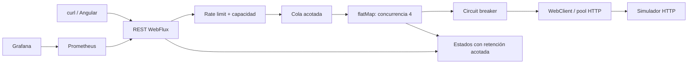

# Arquitectura antes de implementar

## 1. Propuesta
Un servicio WebFlux expone una API de admisión y consulta. Una cola en memoria acotada entrega a un único consumidor Reactor con `flatMap(..., concurrency)`. WebClient envía al simulador independiente. Angular es un cliente de demostración; Prometheus y Grafana observan el backend. No se añaden base de datos, broker ni microservicios innecesarios.

## 2. Estructura
`src/main/java/dev/portfolio/{api,application,domain,infrastructure}`; `src/test/java`; `simulator/`; `frontend/`; `ops/`; `docs/adr/`; `examples/`. Dominio sin Spring; aplicación gestiona admisión/estados; infraestructura gestiona HTTP y resiliencia; API valida contratos.

## 3. Flujo
Validar importe/moneda/escenario y correlation ID → comprobar rate limit y capacidad → guardar QUEUED → encolar → responder 202 con Location → RUNNING → llamada HTTP → SUCCEEDED o FAILED. El cliente consulta por ID; 202 nunca promete éxito financiero.

## 4. Dependencias
Java 21, Spring Boot estable compatible (versión fijada en pom), WebFlux, Validation, Actuator, Micrometer Prometheus, Resilience4j core/Reactor/Micrometer, Reactor Netty. JUnit, Mockito y Reactor Test. Angular standalone, TypeScript, RxJS. Simulador Node sin dependencias externas.

## 5. Asincronía
El worker es dueño de la suscripción, su ciclo de vida y sus errores. El controlador no invoca `subscribe()`. Fire-and-forget significa desacoplar la respuesta de admisión de la entrega, no ignorar errores. Sin `@Async`, sleeps ni I/O bloqueante en el event loop. No hay reintentos: un timeout tiene resultado remoto desconocido; repetir una operación financiera sin contrato de idempotencia es inseguro.

## 6. Pool
4 conexiones, máximo 4 adquisiciones pendientes, espera de adquisición 250 ms, conexiones ociosas 20 s, vida máxima 2 min; métricas habilitadas. Concurrencia 4 alineada con el pool. Cola de aplicación 16, máximo en vuelo 20. La admisión cuenta queued + running mediante un permiso liberado al terminar.

## 7. Timeouts
Connect 500 ms; response (inactividad de lectura) 1500 ms; deadline total de la llamada 2 s incluyendo adquisición. Un response timeout no cubre toda la operación. El tiempo de cola se mide aparte. El simulador tiene un escenario sin respuesta y uno lento de 3 s.

## 8. Rate limiting
Admisión global por instancia: 10 solicitudes/s, sin espera. Saturación → 429 con Retry-After; capacidad agotada → 503. El proveedor tiene su propio límite de 5 solicitudes/s y puede devolver 429; ese 429 se registra como fallo remoto, no cambia retroactivamente el 202. No es una defensa distribuida contra abuso.

## 9. Circuit breaker
Resilience4j, ventana de 10 llamadas, mínimo 5, umbral 50%, espera OPEN de 5 s, 2 pruebas HALF_OPEN. 5xx y timeouts cuentan; 429 remoto se registra pero se excluye del porcentaje de fallos. Rechazos de admisión y circuit open no son llamadas remotas. Sin fallback que invente un éxito.

## 10. Observabilidad
Correlation ID acotado, validado y propagado; contexto traceparent W3C validado y propagado explícitamente (sin exportación de spans). Logs de cambios de estado sin payload financiero. Métricas de accepted/rejected/completed, queue wait, entrega, latencia end-to-end, in-flight, cola, pool y circuit breaker; histogramas y percentiles en Prometheus. IDs nunca son etiquetas de métricas. Actuator y herramientas de demo se limitan a uso local; producción requeriría autenticación y segmentación.

## 11. Pruebas
Unitarias para validación, clasificación y admisión; integración con HTTP real en puerto efímero para success, 500, slow, never, 429, propagación de IDs, circuit open/recovery y saturación. Verificar que POST devuelve 202 sin esperar al proveedor, y que errores terminan en estados consultables. Angular build estricto y comprobación del stack Compose cuando Docker esté disponible.

## Límites deliberados
Almacenamiento y cola volátiles; limpieza de terminales de más de 15 min al admitir nuevas operaciones, máximo 1000 registros; reiniciar pierde registros. Shutdown deja de admitir, espera hasta 5 s y cancela trabajo pendiente. No es un procesador de pagos productivo. Los límites se configuran y deben dimensionarse mediante mediciones.
